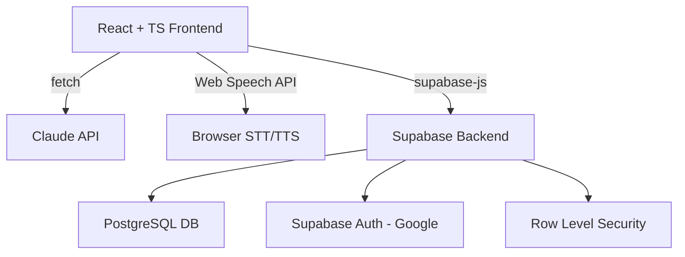
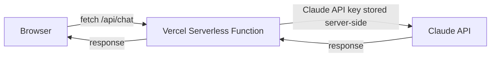
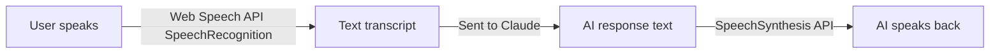

# Bliff — DSA Interview Coach: Architecture Overview

## High-Level Architecture



## Core Architecture Decisions

### 1. Frontend-Only Architecture — No Custom Backend
- All AI calls go directly from browser to Claude API
- All DB calls go through supabase-js client
- **Pros**: Zero backend to deploy/maintain, fast iteration
- **Cons**: API key exposed in browser — see Risk section

### 2. Recommended Improvement: Edge Function Proxy
Instead of calling Claude directly from the browser, route through a **Supabase Edge Function** or **Vercel Serverless Function**:



**Why**: Your Claude/OpenAI API key must NOT be in the frontend bundle. A single serverless function solves this cleanly.

### 3. Voice Pipeline



- `SpeechRecognition` supports `lang: en-US` and `lang: vi-VN`
- `SpeechSynthesis` uses browser voices — quality varies by OS

## Gaps Identified in Original Plan

| # | Gap | Recommendation |
|---|-----|----------------|
| 1 | API key exposure in frontend | Add Vercel serverless proxy or Supabase Edge Function |
| 2 | No code editor mentioned | Add Monaco Editor for writing solutions in-app |
| 3 | No code execution/validation | Phase 3+: consider Judge0 API or simple test runner |
| 4 | Claude API vs OpenAI — you said OpenAI-compatible but want Claude | Clarify: use Anthropic Claude API directly |
| 5 | No offline/fallback for voice | Add text input as fallback when speech fails |
| 6 | Rate limiting on free Supabase | Design for minimal DB calls, cache profile client-side |
| 7 | No session timer mentioned | Add visible countdown timer for interview simulation |

## Component Map

```
src/
  components/
    InterviewRoom/     — main interview UI, voice controls, chat display
    CodeEditor/        — Monaco editor for writing solutions
    Dashboard/         — progress charts, streak, weak areas
    QuestionCard/      — question display with examples
    FeedbackPanel/     — post-session structured feedback
  hooks/
    useVoice.ts        — Web Speech API wrapper
    useInterview.ts    — interview state machine
    useProfile.ts      — user profile + history from Supabase
    useAdaptive.ts     — question selection logic
  services/
    ai.ts              — Claude API calls via serverless proxy
    supabase.ts        — Supabase client setup
    questions.ts       — question fetching + filtering
  types/
    index.ts           — shared TypeScript types
  lib/
    promptBuilder.ts   — dynamic system prompt construction
    adaptiveEngine.ts  — weighted question selection algorithm
```

## Next Files
- `02-supabase-schema.md` — Full database schema
- `03-system-prompt-design.md` — Dynamic prompt structure
- `04-build-phases.md` — Phased delivery plan
- `05-technical-risks.md` — Risk register
