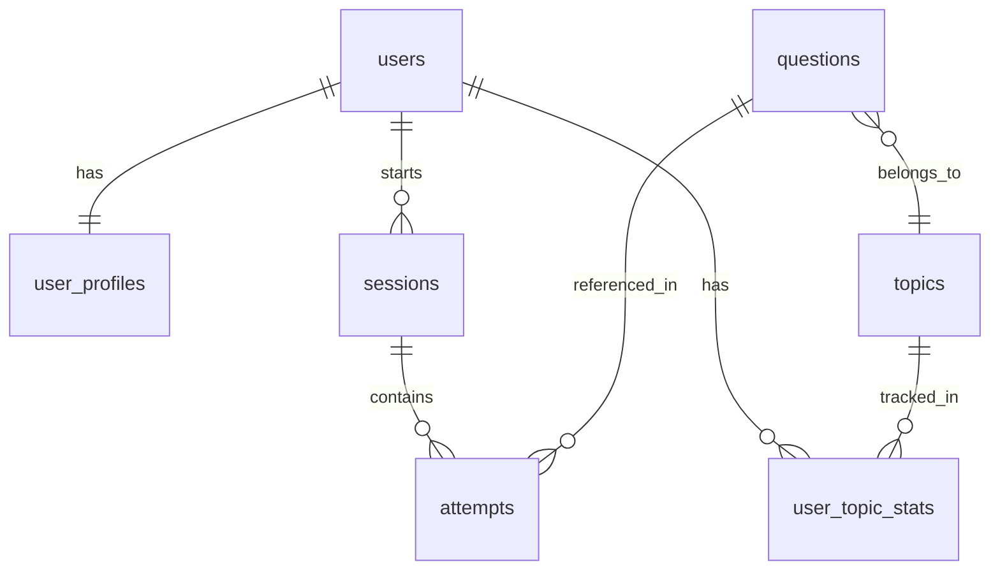

# Bliff — Supabase Database Schema

## Entity Relationship Diagram



## Table Definitions

### 1. users
Managed by Supabase Auth automatically. We reference `auth.users.id` everywhere.

No custom `users` table needed — Supabase Auth handles this.

---

### 2. user_profiles
Stores personalized context that shapes AI behavior.

| Column | Type | Notes |
|--------|------|-------|
| id | uuid PK | References `auth.users.id` |
| display_name | text | e.g. "Anh" |
| experience_years | integer | 6 |
| primary_role | text | "Frontend Engineer" |
| target_companies | text[] | ["Google", "Meta", ...] |
| preferred_languages | text[] | ["javascript", "typescript"] |
| voice_language | text | "en-US" or "vi-VN" |
| strengths | text[] | Updated over time by AI feedback |
| weaknesses | text[] | Updated over time by AI feedback |
| notes | text | Free-form AI-readable context |
| current_streak | integer | Days in a row |
| longest_streak | integer | All-time best |
| last_session_date | date | For streak calculation |
| created_at | timestamptz | Default now |
| updated_at | timestamptz | Auto-updated |

---

### 3. topics
Static reference table for DSA categories.

| Column | Type | Notes |
|--------|------|-------|
| id | uuid PK | Auto-generated |
| name | text UNIQUE | e.g. "Arrays", "Dynamic Programming" |
| slug | text UNIQUE | e.g. "arrays", "dynamic-programming" |
| category | text | "dsa" or "frontend" |
| display_order | integer | For UI sorting |

**Seed data**: Arrays, Two Pointers, Sliding Window, Stack, Binary Search, Linked List, Trees, Tries, Heap, Backtracking, Graphs, Dynamic Programming, Greedy, Intervals, Math, Bit Manipulation, Frontend-DOM, Frontend-CSS, Frontend-JS, Frontend-React, Frontend-Performance, Frontend-System-Design

---

### 4. questions
The full question bank — Blind 75 + NeetCode 150 + FE questions.

| Column | Type | Notes |
|--------|------|-------|
| id | uuid PK | Auto-generated |
| title | text | e.g. "Two Sum" |
| slug | text UNIQUE | e.g. "two-sum" |
| topic_id | uuid FK | References topics.id |
| difficulty | text | "easy", "medium", "hard" |
| source | text | "blind75", "neetcode150", "fe-curated" |
| description | text | Full problem statement |
| examples | jsonb | Array of input/output examples |
| constraints | text[] | e.g. ["1 <= nums.length <= 10^4"] |
| hints | text[] | Ordered from subtle to obvious |
| expected_approach | text | Ideal solution description |
| expected_time_complexity | text | e.g. "O(n)" |
| expected_space_complexity | text | e.g. "O(n)" |
| tags | text[] | Extra tags like "hash-map", "sorting" |
| leetcode_number | integer | nullable, for LC reference |
| is_active | boolean | Default true |
| created_at | timestamptz | Default now |

---

### 5. sessions
One row per interview practice session.

| Column | Type | Notes |
|--------|------|-------|
| id | uuid PK | Auto-generated |
| user_id | uuid FK | References auth.users.id |
| started_at | timestamptz | When session began |
| ended_at | timestamptz | nullable, when session ended |
| mode | text | "interview", "practice", "review" |
| voice_language | text | Language used this session |
| overall_score | integer | nullable, 1-10 from AI feedback |
| ai_feedback_summary | text | One-paragraph AI assessment |
| created_at | timestamptz | Default now |

---

### 6. attempts
Each question attempted within a session.

| Column | Type | Notes |
|--------|------|-------|
| id | uuid PK | Auto-generated |
| session_id | uuid FK | References sessions.id |
| user_id | uuid FK | References auth.users.id |
| question_id | uuid FK | References questions.id |
| started_at | timestamptz | When question was presented |
| ended_at | timestamptz | nullable |
| duration_seconds | integer | Computed or stored |
| status | text | "solved", "partial", "gave_up", "in_progress" |
| hints_used | integer | How many hints were requested |
| asked_clarifying | boolean | Did user ask clarifying questions? |
| solution_code | text | Final code user wrote |
| approach_used | text | e.g. "hash map", "two pointers" |
| time_complexity_given | text | What user said the complexity was |
| space_complexity_given | text | What user said |
| ai_score | integer | 1-10 from AI evaluation |
| ai_feedback | jsonb | Structured feedback object — see below |
| conversation_log | jsonb | Full message history for review |
| created_at | timestamptz | Default now |

**ai_feedback jsonb structure:**
```json
{
  "approach_score": 8,
  "complexity_score": 7,
  "edge_cases_score": 6,
  "communication_score": 9,
  "code_quality_score": 8,
  "strengths": ["Good problem decomposition", "Asked clarifying questions"],
  "improvements": ["Missed empty array edge case", "Could optimize space"],
  "summary": "Strong attempt. Consider edge cases more carefully."
}
```

---

### 7. user_topic_stats
Aggregated stats per user per topic — updated after each attempt.

| Column | Type | Notes |
|--------|------|-------|
| id | uuid PK | Auto-generated |
| user_id | uuid FK | References auth.users.id |
| topic_id | uuid FK | References topics.id |
| total_attempts | integer | Default 0 |
| solved_count | integer | Default 0 |
| partial_count | integer | Default 0 |
| gave_up_count | integer | Default 0 |
| avg_score | float | Running average of ai_score |
| avg_duration_seconds | float | Running average |
| last_attempted_at | timestamptz | nullable |
| mastery_level | text | "beginner", "developing", "proficient", "mastered" |
| weight | float | Selection weight — higher = more likely to be picked |

**Unique constraint**: `(user_id, topic_id)`

---

## Row Level Security Policy Summary

All tables use RLS with policies:
- `user_profiles`: Users can only read/write their own row
- `sessions`: Users can only read/write their own sessions  
- `attempts`: Users can only read/write their own attempts
- `user_topic_stats`: Users can only read/write their own stats
- `topics`: Public read, no write from client
- `questions`: Public read, no write from client

## Indexes

- `attempts(user_id, question_id)` — for checking if user has done a question
- `attempts(user_id, status)` — for filtering failed attempts
- `user_topic_stats(user_id)` — for loading full profile
- `sessions(user_id, started_at)` — for streak calculation
- `questions(topic_id, difficulty)` — for adaptive selection
