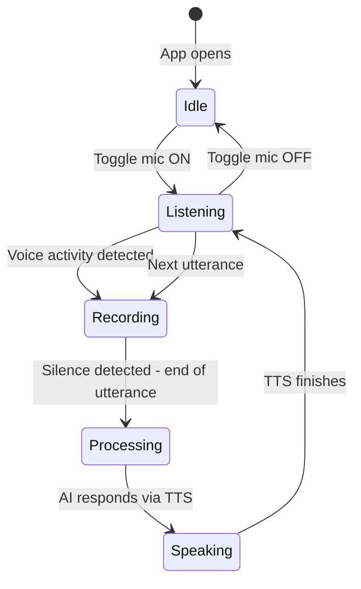

# Bliff — Revised Voice Architecture

## Key Changes Based on Feedback

1. **Local-only app** — no Vercel deployment needed, simplified config
2. **Conversation-first UX** — voice is the primary interface, not buttons
3. **OpenAI-compatible API** — you have a big API quota, lets use it
4. **Seamless voice loop** — open app, toggle mic, start talking immediately

## The Voice Interaction You Want

```
You: "Hi Bliff, I need a mock interview session today.
      Check my progress and give me a question."

Bliff: "Hey Anh! Looking at your stats, you have been strong on 
       arrays and two pointers but your graph problems need work.
       Let me pick a medium graph problem for you today..."
       
You: [speaks naturally throughout the session]
Bliff: [responds via voice, presents problem, gives hints, evaluates]
```

## Voice Pipeline Options Compared

### Option A: Free — Web Speech API Only

- **Cost**: $0
- **STT quality**: Good for English, decent for Vietnamese in Chrome
- **TTS quality**: Robotic, varies by OS, limited voice control
- **Latency**: Low for STT, instant for TTS
- **Browser**: Chrome/Edge only for STT

### Option B: Recommended — Whisper + OpenAI TTS

- **Cost**: ~$0.006/min for Whisper + ~$0.015/1k chars for TTS
- **STT quality**: Excellent for both EN and VI — Whisper is best-in-class
- **TTS quality**: Natural-sounding, multiple voices, supports Vietnamese
- **Latency**: ~1-2s for STT, ~0.5s for TTS with streaming
- **Browser**: Works everywhere — just records audio and plays it back

### Option C: Hybrid — Web Speech STT + OpenAI TTS

- **Cost**: ~$0.015/1k chars for TTS only
- **STT quality**: Depends on browser, good in Chrome
- **TTS quality**: Natural-sounding from OpenAI
- **Latency**: Lowest — no upload for STT

### My Recommendation: Option B — Whisper + OpenAI TTS

**Why**:
- You already have OpenAI API quota — this uses it efficiently
- Whisper handles Vietnamese perfectly — critical for bilingual support
- OpenAI TTS voices sound natural and conversational
- Works in ANY browser since we just record audio via MediaRecorder
- No dependency on browser speech support
- Estimated cost per 30-min session: ~$0.20 for voice + LLM costs

## Seamless Voice Loop — Technical Design

### Always-Listening Mode


### Voice Activity Detection
Instead of push-to-talk, implement **voice activity detection** so the app knows when you start and stop speaking:

1. Use `MediaRecorder` + `AudioContext` with `AnalyserNode`
2. Monitor audio levels in real-time
3. When level exceeds threshold for 300ms: start recording
4. When level drops below threshold for 1500ms: stop recording, send to Whisper
5. This creates a natural conversation flow

### Conversation Context
The AI needs to handle free-form conversation, not just interview Q&A:

```
System prompt addition for conversation mode:

You are Bliff, a personal DSA interview coach. You can:
1. Have casual conversation about interview prep
2. Start a mock interview session when asked
3. Check the users progress and suggest what to practice
4. Present problems and conduct interviews
5. Give feedback and encouragement

When the user asks to start a session, respond with a brief plan 
then transition into interviewer mode. When in interviewer mode, 
follow the interview simulation rules strictly.

Current state: {IDLE | IN_SESSION | REVIEWING}
```

## Simplified Local Setup

Since this is local-only:

```
# .env.local — only file you need to configure
VITE_OPENAI_API_KEY=sk-...          # For Whisper STT + TTS
VITE_ANTHROPIC_API_KEY=sk-ant-...   # For Claude LLM — OR use OpenAI
VITE_SUPABASE_URL=https://xxx.supabase.co
VITE_SUPABASE_ANON_KEY=eyJ...
```

**Note on API key in frontend**: Since this is local-only and never deployed publicly, having the API key in the Vite env is acceptable. No serverless proxy needed. If you ever deploy publicly, add the proxy back.

## Which LLM to Use?

You mentioned "OpenAI-compatible API". Two interpretations:

1. **You have an OpenAI API key** — Use GPT-4o for chat, Whisper for STT, TTS for voice
2. **You have a key for an OpenAI-compatible provider** — e.g. Claude via a proxy, or a local model

For simplicity, I recommend designing an LLM abstraction layer:

```typescript
// services/llm.ts
interface LLMProvider {
  chat: messages => Promise of string
  streamChat: messages => AsyncIterable of string
}

// Swap between OpenAI, Claude, or any compatible provider
```

This way you can use GPT-4o now and switch to Claude or vice versa without changing any other code.
