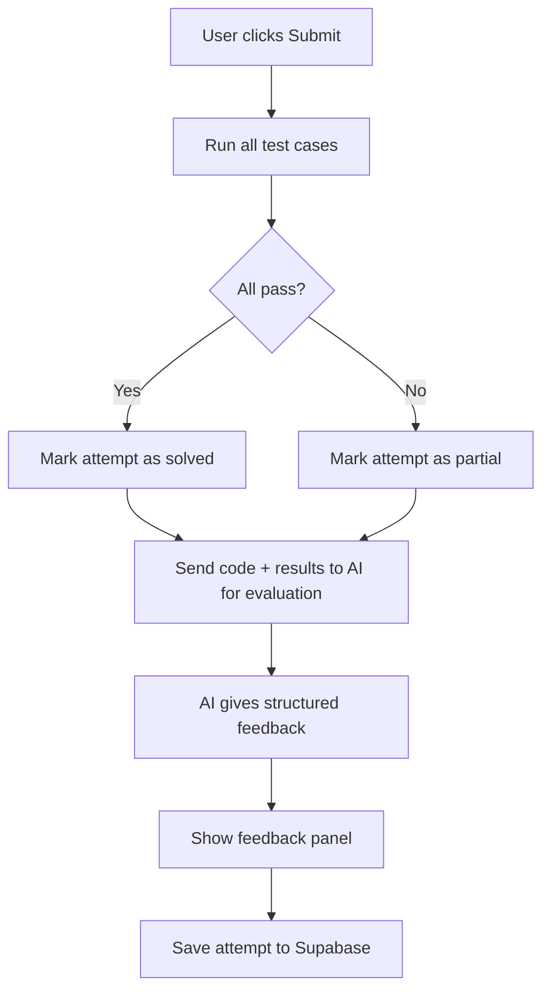

# Bliff — Code Editor and Execution Design

## Decision: Monaco Editor + Browser JS Sandbox

### Why This Stack
- You only use JavaScript/TypeScript for solutions
- Personal local app — security sandbox concerns are minimal
- Zero external dependencies or API costs for code execution
- Instant feedback — no network round-trip

---

## Code Editor: Monaco Editor

Library: `@monaco-editor/react`

### Features we get for free
- Full VS Code experience (syntax highlighting, autocomplete, IntelliSense)
- TypeScript type checking in-browser
- Multiple themes
- Keyboard shortcuts (Cmd+Z, Cmd+/, etc.)
- Diff view for showing AI-suggested solution vs yours

### Editor Component Design
```
InterviewRoom
  └── CodeEditor
        ├── language selector (javascript | typescript)
        ├── Monaco Editor instance
        ├── Run Tests button
        ├── Submit button
        └── TestResults panel
```

---

## Code Execution: Browser JS Sandbox

### How It Works

Each question in the DB has test cases stored as JSONB:
```json
{
  "testCases": [
    {
      "id": 1,
      "input": { "nums": [2,7,11,15], "target": 9 },
      "expected": [0, 1],
      "description": "Basic case"
    },
    {
      "id": 2,
      "input": { "nums": [3,2,4], "target": 6 },
      "expected": [1, 2],
      "description": "Duplicates"
    }
  ],
  "entryPoint": "twoSum",
  "functionSignature": "function twoSum(nums, target) { ... }"
}
```

### Execution Engine

```typescript
// services/codeRunner.ts

interface TestCase {
  id: number
  input: Record<string, unknown>
  expected: unknown
  description: string
}

interface TestResult {
  id: number
  passed: boolean
  input: unknown
  expected: unknown
  actual: unknown
  error?: string
  durationMs: number
}

export function runTests(
  userCode: string,
  testCases: TestCase[],
  entryPoint: string
): TestResult[] {
  return testCases.map(tc => {
    const start = performance.now()
    try {
      // Build execution context
      const args = Object.values(tc.input)
      const fn = new Function(
        ...Object.keys(tc.input),
        `${userCode}\nreturn ${entryPoint}(${Object.keys(tc.input).join(', ')})`
      )
      const actual = fn(...args)
      const durationMs = performance.now() - start
      const passed = JSON.stringify(actual) === JSON.stringify(tc.expected)
      return { id: tc.id, passed, input: tc.input, expected: tc.expected, actual, durationMs }
    } catch (err) {
      return {
        id: tc.id,
        passed: false,
        input: tc.input,
        expected: tc.expected,
        actual: undefined,
        error: err instanceof Error ? err.message : String(err),
        durationMs: performance.now() - start
      }
    }
  })
}
```

### Test Results Display
```
✅ Test 1 (2ms): PASSED
   Input: nums=[2,7,11,15], target=9
   Expected: [0,1] | Got: [0,1]

❌ Test 2 (1ms): FAILED
   Input: nums=[3,2,4], target=6
   Expected: [1,2] | Got: [0,1]

❌ Test 3: ERROR
   Input: nums=[], target=0
   Error: Cannot read properties of undefined
```

---

## The Submit Flow



### What Gets Sent to AI on Submit
```
Here is the candidate's final solution for [Two Sum]:

CODE SUBMITTED:
function twoSum(nums, target) {
  const map = new Map()
  for (let i = 0; i < nums.length; i++) {
    const complement = target - nums[i]
    if (map.has(complement)) return [map.get(complement), i]
    map.set(nums[i], i)
  }
}

TEST RESULTS:
- 4/5 tests passed
- Failed: edge case with empty array

Please evaluate this solution on:
1. Correctness and approach
2. Time and space complexity
3. Edge case handling
4. Code quality and readability
5. What the candidate should have caught

Respond with the structured JSON feedback format.
```

---

## Limitations of Browser Sandbox (Honest Assessment)

| Limitation | Impact | Workaround |
|-----------|--------|------------|
| JavaScript only | You use JS/TS — no impact | N/A |
| No Node.js built-ins (fs, path, etc.) | DSA problems don't need these | N/A |
| No timeout enforcement by default | Infinite loop will freeze tab | Add setTimeout wrapper around execution |
| No memory limit | Pathological inputs could crash tab | Keep test cases reasonable |
| Cannot test async code easily | DSA problems are sync | Wrap async with try/catch |

### Infinite Loop Protection
```typescript
// Wrap execution in a worker with a timeout
const worker = new Worker(...)
worker.postMessage({ code, testCase })
const timeout = setTimeout(() => {
  worker.terminate()
  resolve({ passed: false, error: 'Time Limit Exceeded (>2s)' })
}, 2000)
```

Using a **Web Worker** for execution also gives true sandboxing — if the code crashes, it doesn't affect the main UI thread.

---

## Phase Rollout

| Phase | Code Editing | Execution | Testing |
|-------|-------------|-----------|---------|
| Phase 1 | Monaco Editor embedded | None — AI evaluates code by reading it | No test runner |
| Phase 2 | Monaco Editor + Run button | Browser sandbox with test cases | Basic test results |
| Phase 3 | Monaco + Run + Web Worker sandbox | Full sandbox with TLE protection | Full test suite per question |
