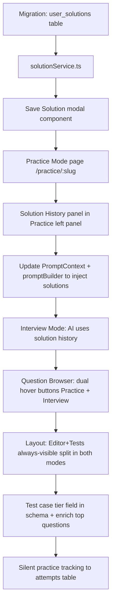

# Bliff — Phase 4 Feature Plan

> **CODING RULE — avoid stream truncation errors:**
> When writing large SQL migration files, write **ONE file per `write_to_file` call**.
> Never call multiple `write_to_file` tools in the same response turn — the second call
> always fails with "missing nativeArgs" due to response stream truncation.
> Pattern: write one file → wait for confirmation → write the next file.

## Practice Mode, Multi-Solution Tracking, Layout Redesign, Rich Test Cases

---

## Overview

Four interconnected features that transform Bliff from a single-mode interview simulator into a full learning platform:

1. **Practice Mode** — separate from Interview Mode, user-driven, code-first
2. **Multi-Solution Tracking** — save ranked solutions per question; AI learns from them
3. **Layout Redesign** — editor + tests always visible simultaneously; AI chat in left panel
4. **Rich Test Cases** — schema + tier structure defined now; data enriched per question over time

---

## 1. Route Architecture

### Current
```
/interview/:slug   → InterviewRoom (all modes, stage machine)
```

### New
```
/questions              → Question Browser (existing, updated hover actions)
/practice/:slug         → PracticePage (new)
/interview/:slug        → InterviewPage (renamed/refined from InterviewRoom)
```

### Question Browser hover actions
Each row gets two hover buttons:
- `▶ Practice` → navigates to `/practice/:slug`
- `🎙 Interview` → navigates to `/interview/:slug`

The existing single "Practice →" hint span becomes these two distinct buttons.

---

## 2. Practice Mode — New Page

### Route
`/practice/:slug`

### Philosophy
- No stage machine, no warm-up, no structured flow
- User opens a question, writes code, runs tests, saves solutions
- AI is **opt-in**: a collapsible AI panel can be toggled on to get hints, analysis, or compare solutions
- Silent tracking always on: time on page, run count, test pass rate → fed into `user_topic_stats`

### Layout

```
┌──────────────────┬─────────────────────────────────────────┐
│  LEFT PANEL      │  RIGHT PANEL                            │
│  (w-80)          │                                         │
│  ┌────────────┐  │  ┌─── EDITOR (flex-1, min ~60%) ──────┐ │
│  │ Problem    │  │  │  Monaco editor                      │ │
│  │ desc +     │  │  │                                     │ │
│  │ examples + │  │  │  [▶ Run Tests] [Save Solution ▾]    │ │
│  │ constraints│  │  └─────────────────────────────────────┘ │
│  └────────────┘  │  ── drag handle ────────────────────── │ │
│  ── divider ──   │  ┌─── TEST RESULTS (flex-shrink, ~40%)┐ │
│  ┌────────────┐  │  │  Collapsible — expands on run       │ │
│  │ AI Panel   │  │  │  Pass/fail rows with input/output   │ │
│  │ (toggle)   │  │  └─────────────────────────────────────┘ │
│  │ Hints /    │  │                                         │
│  │ Analysis / │  │                                         │
│  │ Compare    │  │                                         │
│  └────────────┘  │                                         │
└──────────────────┴─────────────────────────────────────────┘
```

### AI Panel modes (toggle via buttons in left panel)
| Mode | What AI does |
|------|-------------|
| **Off** | Silent — only tracks stats |
| **Hint** | "I'm stuck" → progressive hints based on `question.hints[]` |
| **Analyze** | Submit code → AI reviews approach, complexity, edge cases |
| **Compare** | "What's a better solution?" → AI walks through the next optimization tier |

### Silent tracking (always, no AI needed)
When user runs or saves in Practice Mode, record to `attempts` table:
- `mode = 'practice'`
- `solution_code` = current editor content
- `status` = derived from test results
- `hints_used` = count of AI hint requests
- Time on page → `duration_seconds`

---

## 3. Interview Mode — Refined

### What stays
- Stage machine: `idle → warmup → present → clarify → solve → review → feedback`
- Voice controls
- AI-driven conversation flow
- Submit triggers AI feedback

### What changes
- **Run Tests available in `idle` state is removed** (that hack is reverted — Run Tests is a Practice Mode feature)
- **Test results panel** appears inline below editor (same layout as Practice Mode) instead of being a tab
- **AI chat always in left panel** below problem description — no tab switching between Problem and Chat
- **"Save Solution" button** added next to Submit — saves current code as a ranked solution

### Layout (same split as Practice but stage-aware)
```
┌──────────────────┬─────────────────────────────────────────┐
│  LEFT PANEL      │  RIGHT PANEL                            │
│                  │                                         │
│  Problem desc    │  Editor (top ~60%)                      │
│  ─────────────   │  ── drag handle ──                      │
│  AI Chat         │  Test Results / AI Feedback (bottom ~40%)│
│  (always visible)│                                         │
│  ─────────────   │                                         │
│  Voice controls  │                                         │
└──────────────────┴─────────────────────────────────────────┘
```

---

## 4. Multi-Solution Tracking

### New DB table: `user_solutions`

```sql
CREATE TABLE user_solutions (
  id                uuid PRIMARY KEY DEFAULT gen_random_uuid(),
  user_id           uuid NOT NULL REFERENCES auth.users(id) ON DELETE CASCADE,
  question_id       uuid NOT NULL REFERENCES questions(id) ON DELETE CASCADE,
  attempt_id        uuid REFERENCES attempts(id) ON DELETE SET NULL,
  label             text NOT NULL,         -- "Brute Force", "Hash Map", "Optimized", "Custom"
  rank              integer NOT NULL,      -- 1=first, 2=improved, ...
  code              text NOT NULL,
  language          text NOT NULL DEFAULT 'javascript',
  time_complexity   text,                  -- e.g. "O(n)"
  space_complexity  text,                  -- e.g. "O(n)"
  ai_notes          text,                  -- AI commentary on this specific solution
  is_best           boolean NOT NULL DEFAULT false,
  created_at        timestamptz NOT NULL DEFAULT now(),
  updated_at        timestamptz NOT NULL DEFAULT now(),
  UNIQUE (user_id, question_id, rank)
);

-- RLS: users can only access their own solutions
ALTER TABLE user_solutions ENABLE ROW LEVEL SECURITY;
CREATE POLICY "own solutions" ON user_solutions
  USING (auth.uid() = user_id);

-- Indexes
CREATE INDEX user_solutions_user_question ON user_solutions (user_id, question_id);
```

### Label options (dropdown in Save Solution modal)
1. Brute Force
2. Better — [describe approach]
3. Optimal
4. Alternative
5. Custom label (free text)

### Rank assignment
- Auto-increments per `(user_id, question_id)`
- User can reorder/relabel any time

### Save Solution modal fields
```
Label:           [Brute Force ▾]
Time complexity: [O(n²)       ]   (pre-filled by AI if analyze was run)
Space complexity:[O(1)        ]
Notes:           [optional free text]
[Cancel]  [Save]
```

### Solution History panel (in Practice Mode, left panel bottom)
Shows all saved solutions for the current question:
```
Solutions for Two Sum
  #1  Brute Force   O(n²)   ●  [View] [Set Best]
  #2  Hash Map      O(n)    ★  [View] [Set Best]  ← is_best
```

---

## 5. AI Context — Solution History Injection

### Current `PromptContext` (in `promptBuilder.ts`)
```ts
interface PromptContext {
  profileSummary?: string
  topicMastery?: { topicName, masteryLevel, totalAttempts, avgScore }
}
```

### Extended `PromptContext`
```ts
interface PromptContext {
  profileSummary?: string
  topicMastery?: { topicName, masteryLevel, totalAttempts, avgScore }
  previousSolutions?: {          // NEW — loaded from user_solutions
    label: string                // "Brute Force", "Hash Map"
    rank: number
    timeComplexity: string
    spaceComplexity: string
    aiNotes?: string
    code?: string                // included in practice mode; omitted in interview to avoid spoilers
  }[]
}
```

### AI behavior with solution history

**In Interview Mode (code omitted — no spoilers):**
> "I can see you've previously solved this with a Brute Force O(n²) approach and a Hash Map O(n) approach. Today, let's focus on whether you can communicate the trade-offs and explore any space optimizations."

**In Practice Mode (code included):**
> "You saved two solutions before. Your Hash Map solution looks good — shall we look at whether there's a way to solve this with O(1) extra space?"

**System prompt injection template:**
```
[CANDIDATE SOLUTION HISTORY FOR THIS QUESTION]
The candidate has already solved this problem before. Do NOT ask them to start from scratch.
Previous solutions:
  1. Brute Force — O(n²) time, O(1) space
  2. Hash Map — O(n) time, O(n) space ← current best

Start the conversation from where they are. Challenge them to go deeper, not re-explain the basics.
```

---

## 6. Rich Test Cases — Schema & Tier Structure

### Tier definition (stored as a `tier` field in each `TestCaseRow`)

```ts
interface TestCaseRow {
  input: Record<string, unknown>
  expected: unknown
  description?: string
  tier?: 'basic' | 'edge' | 'corner' | 'performance'  // NEW
}
```

### Target counts per question
| Tier | Count | Run by default? |
|------|-------|----------------|
| basic | 2–3 | Always |
| edge | 3–4 | Always |
| corner | 2–3 | Always |
| performance | 0–1 | Only after Web Worker sandbox (Phase 4 item 1) |

### Total: 8–12 per question (performance tier deferred until Web Worker lands)

### Data enrichment approach
- Schema + tier field added now via migration
- Enrich top-priority questions first: all Arrays, Two Pointers, DP questions (most commonly asked)
- Remaining questions enriched in a background pass or as part of Phase 5

---

## 7. New `solutionService.ts`

```ts
// src/services/solutionService.ts

fetchSolutionsForQuestion(questionId: string): Promise<UserSolutionRow[]>
saveSolution(params: SaveSolutionParams): Promise<UserSolutionRow>
updateSolution(id: string, updates: Partial<SaveSolutionParams>): Promise<void>
deleteSolution(id: string): Promise<void>
markAsBest(id: string, questionId: string): Promise<void>   // clears others, sets this one
```

---

## 8. Implementation Order



---

## 9. File Changes Summary

| File | Change |
|------|--------|
| `supabase/migrations/...026_user_solutions.sql` | New table + RLS + indexes |
| `supabase/migrations/...027_testcase_tiers.sql` | Add tier field to test_cases JSONB |
| `src/types/database.ts` | Add `UserSolutionRow`, extend `TestCaseRow` with `tier` |
| `src/types/index.ts` | Add `UserSolution` type, extend `PromptContext` |
| `src/services/solutionService.ts` | New — CRUD for user_solutions |
| `src/lib/promptBuilder.ts` | Inject `previousSolutions` into system prompt |
| `src/pages/PracticePage.tsx` | New — Practice Mode page |
| `src/pages/QuestionBrowserPage.tsx` | Dual hover buttons: Practice + Interview |
| `src/components/InterviewRoom.tsx` | Layout refactor: AI chat in left, editor+tests split |
| `src/components/SaveSolutionModal.tsx` | New — save solution UI |
| `src/components/SolutionHistory.tsx` | New — ranked solution list in left panel |
| `src/hooks/usePractice.ts` | New — practice mode state: run count, time, AI toggle |
| `src/App.tsx` | Add `/practice/:slug` route with `KeyedPracticePage` wrapper |

---

## 10. What's Explicitly Out of Scope for This Phase

- Multi-language support (Python, Java) — separate Phase 4 item
- Side-by-side diff viewer for solutions — nice-to-have, post-MVP
- Sharing solutions publicly — not needed for personal tool
- AI auto-generating test cases — interesting but complex; defer
